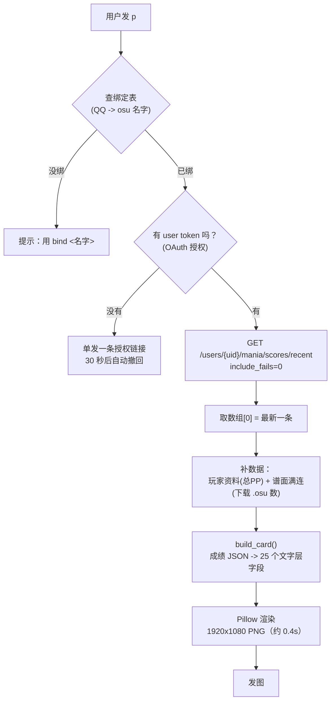

# `p` 指令的实现原理

> 对应插件：`astrbot_plugin_osu_scorecard`
> 相关文件：`main.py`（流程）、`card.py`（数据组装）、`render.py`（出图）、`osu_api.py` / `sb_api.py`（取数）

## 一句话

`p` = 「取你绑定那个人的**最近一条通过的成绩**，渲染成成绩卡发出来」。

`r` 和它几乎完全一样，**只差一个参数**。

---

## 流程图



---

## `p` 和 `r` 的区别：只有一个参数

| 指令 | 参数 | 含义 |
|---|---|---|
| **`p`** | `include_fails=0` | 只要**通过**的（不算 fail） |
| **`r`** | `include_fails=1` | 全部**游玩**记录（含 fail） |

两者**共用同一条代码路径**。`/scores/recent` 返回的就是**时间倒序数组**，`[0]` 即最近一条 —— 差异只在服务端这一个开关上，**不是在客户端筛选**。

想要「只看 fail 的」，改这个参数即可。

---

## 为什么必须 OAuth

osu! 官方对 `/users/{user}/scores/recent` 这个端点**只认 user token**（用户本人授权），
application token（client_credentials）**一律返回 404**。这是 osu! 的硬规定，绕不过去。

> **注意**：`p` 查的不是「你自己的」成绩，而是**你绑定的那个名字**。
> 但因为端点限制，**必须是被绑定那个人本人授权过**才能读。

yumu-bot 的 `p` 也是同一套机制 —— 它的 `OsuConfig.kt` 里 `callbackPath = "/bind"` 就是接这个授权的。

**私服不受此限**：`api.ppy.sb` 的 `/v1/get_player_scores?scope=recent` 是**公开接口**，
只要用户名或 id，不需要任何授权。所以 `p -sb` 一直能用，而 `p`（官服）不行。

---

## 为什么 MAP COMBO 那一格要单独费劲

官服和私服的**内嵌满连字段都不可靠**：

- **官服**：`beatmap.max_combo` 是 **lazer 口径**（bid 5493536 给 3243）
- **私服**：`score.beatmap.max_combo` 是**脏数据**，永远等于 `score.max_combo`

而卡片显示的是 stable 成绩的连击，取的是 **stable 口径**（同一张图数出来是 2922）。
所以要单独下载谱面文件自己数：

```
https://osu.ppy.sh/osu/<bid>     # 公开端点，无需授权
```

然后数 `[HitObjects]`：**普通键算 1 combo，长条算 2 combo**。

**降级顺序**（`card.resolve_map_max_combo()`）：

1. **满连** → 玩家自己的 `max_combo`（精确、**零网络**，最常见）
2. **数 .osu** → 真实满连
3. **退回** `beatmap.max_combo`（不精确，但至少是个数）
4. **都没有** → 显示 `--`

外加一条**否决规则**：候选值 < 玩家自己的连击 → 丢弃（谱面满连不可能小于已打出的连击）。

**缓存**：`data/plugin_data/<插件名>/map_combo_cache.json`，冷启动约 0.7s，命中约 0s，默认 TTL 30 天，
**失败不写缓存**（一次网络抖动不会变成 30 天的 `--`）。

---

## 几个容易踩的点

| 环节 | 关键点 |
|---|---|
| **绑定表分服** | `bind F6A8AF` 和 `bind F6A8AF -sb` 是**两条独立记录**，互不覆盖 |
| **授权是一次性的** | 授权一次后 `refresh_token` 存盘（30 天），每次刷新会换新。**不用反复授权** |
| **渲染引擎** | 服务器上没 Photoshop，走 `render.py`（Pillow），约 0.4 秒；本机可以走 Photoshop |
| **撤回和绑定状态解耦** | 只要发了授权链接就 30 秒后撤回，不管用户有没有完成绑定 |
| **链接两条发送路径** | `bind`/`authorize` 和 `p`/`r` 未授权时**必须走同一个函数**，否则有一条会漏掉撤回 |

---

## 失败时的表现

| 情况 | 现象 |
|---|---|
| 没绑定 | 提示用 `bind <名字>` |
| 绑了但没授权 | 单发一条授权链接（30 秒撤回） |
| 已授权但最近没有成绩 | 提示没有可渲染的成绩 |
| 网络不通 | 重试 3 次后报「连接超时」之类的人话（**不再只报 `URLError` 这种光秃秃的类型名**） |
